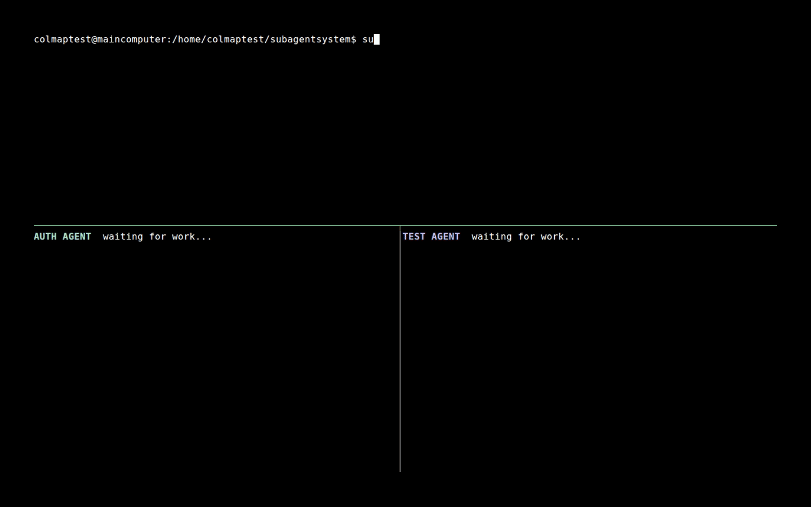

# subagent

[](https://github.com/randomvibecoder/subagent/actions/workflows/ci.yml)
[](https://github.com/randomvibecoder/subagent/releases/latest)
[](LICENSE)

**Persistent coding agents for other agents.**

`subagent` is a small Linux CLI and daemon that lets an agent delegate work, continue
doing something else, and return when the delegated work is ready. Every operational
response is compact JSONL: no tables, ANSI formatting, or interactive output to parse.



## Install

Supported platform: **Linux x86-64**. The release is one statically linked binary and
does not require root access or a system runtime.

```sh
curl -fsSL https://raw.githubusercontent.com/randomvibecoder/subagent/main/install.sh | sh
```

The installer downloads the latest release and checksum, verifies SHA-256, installs
to `$HOME/.local/bin/subagent`, and prints the installed version. To inspect it first:

```sh
curl -fsSLO https://raw.githubusercontent.com/randomvibecoder/subagent/main/install.sh
less install.sh
sh install.sh
```

Set `SUBAGENT_INSTALL_DIR` to use another user-owned destination:

```sh
curl -fsSL https://raw.githubusercontent.com/randomvibecoder/subagent/main/install.sh |
  SUBAGENT_INSTALL_DIR="$HOME/bin" sh
```

## Quick start

Start the per-user daemon with an OpenAI API key:

```sh
export OPENAI_API_KEY='...'
subagent daemon start
```

The defaults are `https://api.openai.com/v1` and `gpt-5.4-mini`. Any compatible
Chat Completions endpoint can be selected with `OPENAI_BASE_URL` and `OPENAI_MODEL`.

Spawn independent work and keep the returned short reference:

```sh
subagent agents spawn \
  --name "Fix authentication" \
  --dir "$HOME/projects/my-app" \
  --mode write \
  --message "Find and fix the login regression, then run the relevant tests."
```

```json
{"type":"agent","id":"agt_01...","ref":"a_1","status":"working"}
```

Coordinate several workers without importing their raw transcripts:

```sh
subagent agents list --status working
subagent inbox list --priority 2
subagent agents logs a_1
subagent agents send a_1 --message "Also check token refresh behavior."
```

`send` durably queues the message and returns immediately. A finished, stopped, or
failed agent resumes as a new run; a working agent consumes it at the next model
boundary.

## Why a daemon?

The CLI is a thin JSONL client over a private Unix socket. The daemon owns active
workers while agent metadata, context, messages, notifications, events, and complete
terminal output are persisted on disk.

```text
calling agent -> subagent CLI -> Unix socket -> daemon -> model + tools
                                              |-> agent A
                                              |-> agent B
                                              `-> agent C
```

Finished agents leave memory and can be resumed later. Interrupted agents are
reconciled on restart, and pending messages survive daemon failure. Eight main agents
may work concurrently by default; configure another limit with `max-agents` or
`SUBAGENT_MAX_AGENTS` (`0` explicitly means unlimited).

## Core commands

| Command | Purpose |
| --- | --- |
| `daemon start\|status\|stop` | Operate the per-user daemon |
| `agents spawn\|list\|status\|rename` | Create and inspect persistent agents |
| `agents logs ID` | Read the newest 20 transcript events or select/follow other types |
| `agents send ID` | Durably steer or resume an agent |
| `agents time\|stop\|delete ID` | Manage lifecycle and cleanup |
| `sides create\|list\|status\|logs\|stop\|delete` | Run saved one-shot Side questions |
| `messages list\|status\|cancel` | Inspect durable queued messages |
| `inbox list`, `inbox ack`, `inbox follow` | Read, acknowledge, or stream high-signal notifications |
| `config list\|get\|set` | Manage non-secret configuration |

Run any command with `--help` for exact flags. [`SKILL.md`](SKILL.md) is the compact
agent-facing operating guide; [`references/protocol.md`](references/protocol.md) and
[`references/cli.schema.json`](references/cli.schema.json) define exact behavior and
JSONL shapes.

## Agents, Side runs, and tools

Main agents have globally stable `agt_<ULID>` IDs, short installation-local `a_1`
references, and unique 4–40 character display names. Commands accept short refs, full
durable prefixed IDs, or exact Agent names. IDs and refs take precedence over names;
canonical system-shaped names are reserved. Side runs, messages, and Events similarly expose `s_`,
`m_`, and `e_` refs. Local refs are persistent, monotonic per type, and never reused;
use durable IDs for exports and cross-installation data. Each agent can select a model and
work in `readonly` or `write` mode.

Side runs are durable one-shot questions over a snapshot of a parent's context. They
inherit its directory and model by default, save their own answer and tool trace, and
never append to the parent transcript.

Every agent can read files, glob, grep, run Bash, manage up to eight background
terminals, read stored output, view images, and publish notifications. Write agents
also receive `write`, exact `edit`, and OpenAI-style `apply_patch` tools.

`agents logs` intentionally omits tool payloads by default. `agents context` is a raw
debugging escape hatch; redirect it to a file or filter it narrowly rather than
printing an entire model context into another agent's conversation.

Agent, Message, Side, and Inbox lists emit opaque `next_cursor` values for safer
keyset pagination; existing Side/Inbox offsets remain compatible. Messages are
newest-first and bounded to 1000 records per page. Finite logs end with `logs_summary`.
Inbox records are unread by default; each finite query ends with an `inbox_summary`, acknowledgement
uses a durable installation-local watermark, and follow streams JSONL without polling.

## Optional Web UI

When a human is in the loop, start the daemon with the localhost dashboard:

```sh
subagent daemon start --web-ui-port 7341
```

Set `SUBAGENT_WEB_PASSWORD` at daemon startup to require HTTP Basic Auth with username
`subagent`. The Web UI is optional and intentionally excludes daemon configuration and
raw model context.

## Configuration

Environment variables override persisted configuration:

| Variable | Meaning |
| --- | --- |
| `OPENAI_API_KEY` | Required daemon credential; never persisted |
| `OPENAI_BASE_URL` | Chat Completions base URL |
| `OPENAI_MODEL` | Default model |
| `SUBAGENT_MAX_AGENTS` | Concurrent main-agent limit; default `8` |
| `SUBAGENT_STALL_NOTIFICATION_SECONDS` | Possible-stall threshold; default `180`, `0` disables |
| `SUBAGENT_WEB_PASSWORD` | Optional localhost Web UI password |

Persist non-secret settings with `subagent config set`. Restart the daemon after a
configuration or environment change.

State follows XDG directories, normally under `~/.local/state/subagent`. Persisted
daemon lifecycle state lets `daemon status` distinguish a clean stop from an
unexpected crash and points callers to the bounded diagnostic/log location. The daemon
log rotates at 10 MiB with one backup. Agent histories and complete command outputs
remain until their owning agent is deleted, so long-lived installations should clean
up obsolete agents.

## Security

`subagent` is host-native automation, **not a sandbox**. Agents run with the daemon
user's filesystem, process, credential, and network access. Readonly mode removes
structured write tools and instructs the model not to mutate state, but Bash can still
change the host.

Graceful stop cleans up process groups still owned by the running daemon. A daemon
SIGKILL, host crash, or a descendant that escapes its process group can leave work
behind; this is host-native automation, not crash-proof process isolation.

Run the daemon as a user that can access only the projects and credentials agents
should reach. Treat repository content as untrusted instructions. See
[`SECURITY.md`](SECURITY.md) for reporting and the supported security boundary.

## Build and contribute

```sh
cargo build --release --locked
cargo test --locked
```

The portable release uses the `x86_64-unknown-linux-musl` target. See
[`CONTRIBUTING.md`](CONTRIBUTING.md) for the complete validation and release workflow.

Licensed under [Apache-2.0](LICENSE).
